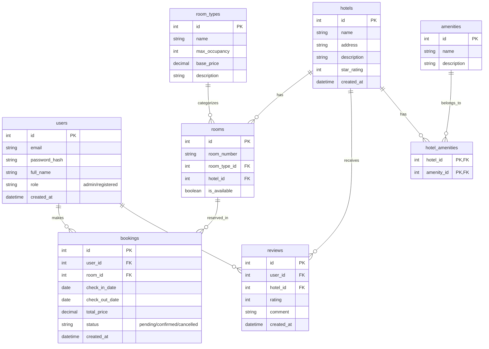

# Roadmap: Hotel Booking REST API (Python + Flask)

## Mục tiêu
Xây dựng RESTful API cho hệ thống đặt phòng khách sạn trực tuyến, áp dụng OOP, MVC, có CSDL 8 bảng, phân quyền Admin / Registered User / Guest.

## Công nghệ sử dụng
- Python 3.10+
- Flask, Flask-SQLAlchemy, Flask-Migrate, Flask-JWT-Extended, Flask-Bcrypt, Flask-CORS
- Marshmallow (validation)
- SQLite (dev) / PostgreSQL (prod)
- Pytest, Flasgger (Swagger)

## Cấu trúc thư mục dự kiến
hotel_booking_api/
├── app/
│ ├── init.py # Tạo Flask app, db, jwt, bcrypt, migrate
│ ├── models/ # Các class Model (SQLAlchemy)
│ │ ├── user.py
│ │ ├── hotel.py
│ │ ├── room.py
│ │ ├── booking.py
│ │ └── review.py
│ ├── controllers/ # Business logic (xử lý nghiệp vụ)
│ │ ├── auth_controller.py
│ │ ├── hotel_controller.py
│ │ ├── booking_controller.py
│ │ └── admin_controller.py
│ ├── views/ # API routes (blueprints)
│ │ ├── auth_routes.py
│ │ ├── hotel_routes.py
│ │ ├── booking_routes.py
│ │ └── admin_routes.py
│ ├── services/ (tuỳ chọn) – tách logic phức tạp
│ ├── schemas/ # Marshmallow schemas
│ ├── utils/ # decorators, helpers, jwt, hash
│ └── config.py # Cấu hình (SQLALCHEMY_DATABASE_URI, SECRET_KEY...)
├── migrations/ (tự sinh)
├── tests/
│ ├── test_auth.py
│ ├── test_hotels.py
│ └── test_bookings.py
├── requirements.txt
├── run.py # Entry point
└── README.md

## Database Schema (8 bảng)

Dưới đây là thiết kế chi tiết cho 8 bảng cơ sở dữ liệu (đáp ứng đúng yêu cầu của hệ thống và giới hạn dưới 10 bảng):

### 1. Sơ đồ thực thể liên kết (ERD)

### 2. Chi tiết các bảng (Tables)

1. **`users`**
   - `id` (Integer, Primary Key): ID người dùng.
   - `email` (String, Unique, Not Null): Email đăng nhập.
   - `password_hash` (String, Not Null): Mật khẩu đã được mã hóa (Bcrypt).
   - `full_name` (String, Not Null): Họ và tên.
   - `role` (String, Default: 'registered'): Quyền của user ('admin', 'registered').
   - `created_at` (DateTime): Thời gian tạo tài khoản.

2. **`hotels`**
   - `id` (Integer, Primary Key): ID khách sạn.
   - `name` (String, Not Null): Tên khách sạn.
   - `address` (String, Not Null): Địa chỉ.
   - `description` (Text): Mô tả.
   - `star_rating` (Integer): Đánh giá sao (1-5).
   - `created_at` (DateTime).

3. **`room_types`**
   - `id` (Integer, Primary Key).
   - `name` (String, Not Null): Loại phòng (VD: Standard, Deluxe, Suite).
   - `max_occupancy` (Integer, Not Null): Số người lưu trú tối đa.
   - `base_price` (Decimal, Not Null): Giá cơ bản/đêm.
   - `description` (Text).

4. **`rooms`**
   - `id` (Integer, Primary Key).
   - `room_number` (String, Not Null): Số hiệu phòng (VD: 101, 102).
   - `room_type_id` (Integer, Foreign Key -> `room_types.id`).
   - `hotel_id` (Integer, Foreign Key -> `hotels.id`).
   - `is_available` (Boolean, Default: True): Trạng thái phòng hiện tại.

5. **`amenities`** (Tiện nghi khách sạn)
   - `id` (Integer, Primary Key).
   - `name` (String, Unique, Not Null): Tên tiện nghi (VD: Hồ bơi, Gym, WiFi).
   - `description` (String).

6. **`hotel_amenities`** (Bảng trung gian n-n giữa hotels và amenities)
   - `hotel_id` (Integer, Foreign Key -> `hotels.id`, Primary Key).
   - `amenity_id` (Integer, Foreign Key -> `amenities.id`, Primary Key).

7. **`bookings`**
   - `id` (Integer, Primary Key).
   - `user_id` (Integer, Foreign Key -> `users.id`).
   - `room_id` (Integer, Foreign Key -> `rooms.id`).
   - `check_in_date` (Date, Not Null).
   - `check_out_date` (Date, Not Null).
   - `total_price` (Decimal, Not Null).
   - `status` (String, Default: 'confirmed'): Trạng thái đặt phòng ('confirmed', 'cancelled', 'completed').
   - `created_at` (DateTime).

8. **`reviews`**
   - `id` (Integer, Primary Key).
   - `user_id` (Integer, Foreign Key -> `users.id`).
   - `hotel_id` (Integer, Foreign Key -> `hotels.id`).
   - `rating` (Integer, Not Null): Điểm đánh giá (1-5).
   - `comment` (Text).
   - `created_at` (DateTime).

## Lộ trình chi tiết (theo tuần)

### Tuần 1: Thiết kế
- [ ] 1.1 Viết danh sách yêu cầu chức năng (CRUD cho từng actor)
- [ ] 1.2 Vẽ sơ đồ ER (8 bảng: users, hotels, room_types, rooms, amenities, hotel_amenities, bookings, reviews)
- [ ] 1.3 Thiết kế class diagram cho các Model (quan hệ, thuộc tính)
- [ ] 1.4 Thiết kế các API endpoints (method, url, quyền truy cập)

### Tuần 2: Khởi tạo dự án + Models + Auth
- [ ] 2.1 Tạo môi trường ảo, cài đặt packages (Flask, SQLAlchemy, JWT, Bcrypt, Marshmallow, Migrate)
- [ ] 2.2 Tạo cấu trúc thư mục như trên
- [ ] 2.3 Viết các class Model trong `app/models/` (kế thừa `db.Model`)
  - [ ] User (id, email, password_hash, full_name, role, created_at)
  - [ ] Hotel (id, name, address, description, star_rating)
  - [ ] RoomType (id, name, max_occupancy, base_price)
  - [ ] Room (id, room_number, room_type_id, hotel_id, is_available)
  - [ ] Booking (id, user_id, room_id, check_in_date, check_out_date, total_price, status, created_at)
  - [ ] Review (id, user_id, hotel_id, rating, comment, created_at)
  - [ ] Amenity, HotelAmenity (nối)
- [ ] 2.4 Tạo migration đầu tiên (Flask-Migrate), tạo database
- [ ] 2.5 Code authentication:
  - [ ] `/auth/register` (POST) – tạo user mới, role mặc định "registered"
  - [ ] `/auth/login` (POST) – trả về access_token (JWT)
  - [ ] Decorator `@login_required`, `@role_required('admin')`
- [ ] 2.6 Test auth bằng Postman hoặc pytest

### Tuần 3: Hotels, Rooms, Amenities (Admin + Guest)
- [ ] 3.1 **Guest/public routes** (không cần token)
  - [ ] `GET /hotels` (phân trang, lọc theo tên, địa chỉ, star_rating)
  - [ ] `GET /hotels/<id>` (chi tiết khách sạn + danh sách room_types + tiện nghi)
  - [ ] `GET /rooms/availability?check_in=...&check_out=...&hotel_id=...` (trả về rooms trống)
- [ ] 3.2 **Admin routes**
  - [ ] `POST /admin/hotels` – tạo khách sạn mới
  - [ ] `PUT /admin/hotels/<id>` – cập nhật
  - [ ] `DELETE /admin/hotels/<id>` – xóa (cascade? chỉ xóa nếu không có booking)
  - [ ] Tương tự cho room_types, rooms, amenities
- [ ] 3.3 Viết controllers cho các logic: tìm phòng trống, kiểm tra xung đột ngày
- [ ] 3.4 Unit test cho các API hotel

### Tuần 4: Bookings & Reviews (Registered user)
- [ ] 4.1 **Booking**
  - [ ] `POST /bookings` (yêu cầu token, role='registered')
    - Kiểm tra phòng trống trong khoảng check_in..check_out
    - Tính total_price = base_price * số đêm
    - Tạo booking với status='confirmed'
  - [ ] `GET /users/me/bookings` – lịch sử đặt của user hiện tại
  - [ ] `DELETE /bookings/<id>` – hủy đặt (chỉ user đó hoặc admin)
- [ ] 4.2 **Review**
  - [ ] `POST /hotels/<id>/reviews` (yêu cầu user đã từng có booking hoàn thành)
  - [ ] `GET /hotels/<id>/reviews` (public, kèm rating trung bình)
- [ ] 4.3 **Admin quản lý người dùng**
  - [ ] `GET /admin/users`
  - [ ] `PUT /admin/users/<id>/role` (thay đổi quyền)
  - [ ] `DELETE /admin/users/<id>`
- [ ] 4.4 Xử lý lỗi toàn cục (global exception handler)

### Tuần 5: Kiểm thử, tài liệu, tối ưu
- [ ] 5.1 Viết integration tests (pytest, fixture client, test database)
- [ ] 5.2 Tích hợp Flasgger (Swagger UI) để tự động sinh tài liệu API
- [ ] 5.3 Thêm logging (log request, error)
- [ ] 5.4 Tối ưu truy vấn: thêm index (check_in_date, user_id, hotel_id), dùng `joinedload` tránh N+1
- [ ] 5.5 Viết file `requirements.txt`, `README.md` hướng dẫn cài đặt & chạy

### Tuần 6: Báo cáo và trình bày
- [ ] 6.1 Hoàn thiện báo cáo đồ án (Word/PDF) gồm:
  - Giới thiệu, sơ đồ lớp (UML class diagram), sơ đồ ER, kiến trúc MVC
  - Danh sách API endpoints (kèm JSON mẫu)
  - Hướng dẫn cài đặt, chạy test
- [ ] 6.2 Đóng gói dự án lên GitHub
- [ ] 6.3 Chuẩn bị slide demo, quay video hoặc live postman/swagger

## Nguyên tắc kỹ thuật cần tuân thủ khi code
- **OOP**: Mỗi model là một class. Mỗi controller là class (hoặc module hàm) thể hiện rõ logic.
- **MVC**: Routes (View) gọi Controller xử lý, Controller dùng Model (SQLAlchemy) để truy vấn, trả về JSON.
- **Phân quyền**: Mọi endpoint đều kiểm tra JWT và role (trừ endpoints public). Dùng decorator `@login_required`, `@admin_required`.
- **Validation**: Dùng Marshmallow để validate input (email, dates, required fields).
- **Xử lý lỗi**: Trả về mã HTTP đúng (400, 401, 403, 404, 500) kèm message.

## Checklist hoàn thành đồ án
- [ ] CSDL có ít nhất 5 bảng (thực tế 8 bảng)
- [ ] Có ít nhất 2 đối tượng user (admin, registered), có guest (không cần token)
- [ ] Các API cơ bản: CRUD khách sạn, đặt phòng, xem lịch sử, đánh giá
- [ ] JWT authentication + role-based access control
- [ ] Sơ đồ lớp (class diagram) được vẽ rõ ràng
- [ ] Áp dụng mô hình MVC
- [ ] Có báo cáo và demo

## Ghi chú cho antigravity
Khi được yêu cầu code từng phần, hãy ưu tiên viết:
- File `config.py` và `app/__init__.py` trước.
- Sau đó lần lượt các model theo thứ tự không phụ thuộc (User → Hotel → RoomType → Room → Booking → Review).
- Tiếp theo là utils (decorators, jwt helper).
- Rồi đến các routes và controllers.
- Cuối cùng là tests và swagger.

Nếu cần thay đổi đề tài hoặc số lượng bảng, hãy đề xuất điều chỉnh nhưng vẫn đảm bảo 5-10 bảng và 2+ loại user.